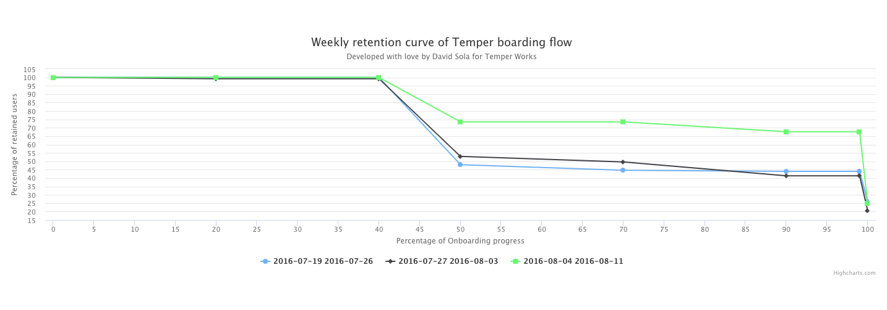

# User Retention Curve
This application shows up a retention curve chart based on the series data coming from the Temper Onboarding flow user retention. 
- Each line represents a weekly cohort.
- The X-axis represents the boarding step of the flow.
- The Y-axis represents the percentage of the users retained in that step.

## Retention Curve Example


## Installation

``` bash
# install dependencies
yarn install

# serve with hot reload at localhost:8080
yarn start

# build for production with minification
yarn build

# build for production and view the bundle analyzer report
yarn build --report
```

## Running the application
You just need to run the local server using the `yarn start` command, so a web-server will be running and pointing to the `index` of this project.